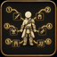

# Glam Levels



Automatically saves your Penumbra mod priorities when you apply a Glamourer design, and restores them instantly when priorities drift.

## The problem it solves

You have multiple Glamourer designs, each depending on specific mods winning priority conflicts in Penumbra. Switching between designs (or installing new mods) reshuffles those priorities, breaking your looks. Fixing them manually every time is tedious.

**Glam Levels handles this automatically.**

## Requirements

- [Glamourer](https://github.com/Ottermandias/Glamourer)
- [Penumbra](https://github.com/xivdev/Penumbra)

## Installation

Add the following URL to Dalamud's custom plugin repositories:

```
https://raw.githubusercontent.com/bimilbimil/GlamLevels/main/repo.json
```

> The repo will be live after the first release is published.

## How it works

**First apply** — When you apply a Glamourer design for the first time, Glam Levels automatically identifies the design and saves a snapshot of your current Penumbra mod priorities. You don't need to do anything.

**Priorities drift** — After switching designs, installing new mods, or reshuffling priorities for another look, your saved design may no longer render correctly.

**Fix it** — Apply the Glamourer design again, then run `/glamlevel fix`. Glam Levels restores every mod to its correct priority for that design. New mods that didn't exist when the snapshot was taken are pushed to priority -999 so they can't interfere.

**After fixing** — Use **Redraw Self** in Penumbra (or re-enter GPose) to see the changes take effect.

**Changed your mind?** — If you've intentionally adjusted priorities and want to update the saved snapshot, run `/glamlevel update`.

## Commands

| Command | Description |
|---|---|
| `/glamlevel` | Open the Glam Levels window |
| `/glamlevel fix` | Restore priorities for the currently active design |
| `/glamlevel fix <name>` | Restore priorities for a specific saved design |
| `/glamlevel update` | Update the current design's saved priorities to match Penumbra now |
| `/glamlevel list` | List all saved design snapshots |
| `/glamlevel save <name>` | Manually save priorities under a custom name |
| `/glamlevel delete <name>` | Delete a saved snapshot |

## UI

Open the window with `/glamlevel`. Each saved design shows a **Fix** button (restore priorities) and an **Update** button (refresh the snapshot with current priorities).

## Edge cases

- **New mods installed after a snapshot was taken** are automatically pushed to priority -999 on restore, so they can't conflict with the original design.
- **Mods that existed at snapshot time with priority 0** are reset back to 0 on restore, even if another design moved them higher.
- **If a design can't be auto-identified** (unusual), Glam Levels falls back to a `[latest]` snapshot. Use `/glamlevel fix [latest]` in that case.
